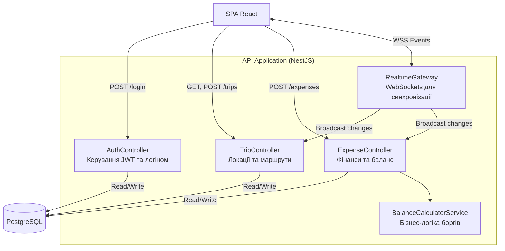
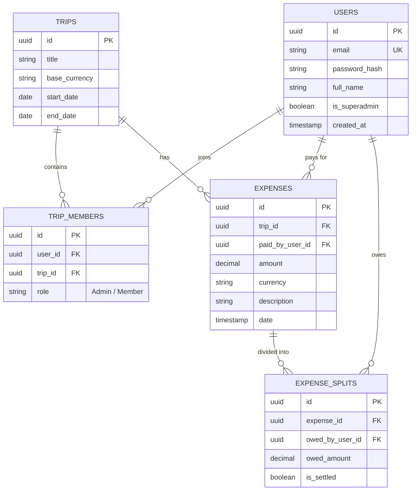

ЗВІТ З ЛАБОРАТОРНОЇ РОБОТИ №2
Проєктування архітектури програмного забезпечення та моделювання даних

Тема проєкту: Вебдодаток для спільного планування подорожей та розділення витрат "TravelSync".

1. Обґрунтування вибору технологічного стеку (Technology Stack)

Для реалізації проєкту "TravelSync" було обрано наступний технологічний стек:

Категорія	Обрана технологія
Back-end	Node.js + NestJS (TypeScript)
Front-end	React (Next.js) + TailwindCSS
База даних (СКБД)	PostgreSQL (Основна БД) + Redis (Кешування/Сесії)
DevOps / Hosting	Docker, GitHub Actions, AWS (EC2/RDS) або Render

Обґрунтування вибору:
Оскільки "TravelSync" передбачає спільну роботу в реальному часі (додавання витрат, голосування, оновлення карти), Node.js є ідеальним вибором завдяки своїй асинхронній природі та вбудованій підтримці WebSockets. Фреймворк NestJS забезпечить строгу архітектуру та типізацію (TypeScript), що критично важливо для фінансових розрахунків. На фронтенді використано React, оскільки він дозволяє легко створити PWA (прогресивний вебдодаток) за принципом Mobile-First для зручного використання в дорозі.

Для бази даних обрано реляційну СКБД PostgreSQL. Оскільки додаток працює з балансами користувачів та розрахунками боргів, нам необхідна сувора консистентність даних та підтримка транзакцій (ACID), яку гарантують реляційні бази (на відміну від NoSQL). Redis додано для управління сесіями та брокера повідомлень для миттєвої синхронізації змін у "Кімнаті подорожі" між учасниками.

2. Архітектурне моделювання за методологією C4

(Нижче наведено код діаграм Mermaid, який GitHub автоматично перетворить на графічні блоки).

Рівень 1: System Context Diagram (Контекст)

Показує систему TravelSync в оточенні користувачів та зовнішніх сервісів.

```mermaid
flowchart TB
    User((Мандрівник Користувач))
    
    subgraph System["TravelSync System"]
        App[Вебдодаток TravelSync Дозволяє планувати маршрут та ділити витрати]
    end
    
    Mail(External: Email Service\nSendGrid / SMTP)
    Map(External: Map API\nMapbox / Google Maps)
    Currency(External: Currency API\nOpenExchangeRates)

    User -->|Створює поїздки, додає витрати| App
    App -->|Надсилає запрошення та сповіщення| Mail
    App -->|Отримує координати та тайли карт| Map
    App -->|Отримує актуальні курси валют| Currency
  ```
    
Рівень 2: Container Diagram (Контейнери)

Розкриває внутрішню структуру системи "TravelSync".

```mermaid
flowchart TB
    User((Мандрівник))
    Map(Map API)
    Currency(Currency API)

    subgraph System ["TravelSync System"]
        WebApp["Single-Page App\n(React)"]
        API["API Application\n(Node.js / NestJS)"]
        DB[(Реляційна БД\nPostgreSQL)]
        Cache[(Cache & Pub/Sub\nRedis)]
    end

    User -->|HTTPS / WSS| WebApp
    WebApp -->|REST API / WebSockets| API
    WebApp -->|Отримує карти напряму| Map
    API <-->|SQL Queries / TypeORM| DB
    API <-->|Кеш сесій, WS події| Cache
    API -->|HTTP GET| Currency
```
    
Рівень 3: Component Diagram (Компоненти)

Деталізує контейнер "API Application" (Backend).



3. Проєктування бази даних (ER-Model)

Варіант А: Реляційна база даних (SQL)
Вибрано реляційну модель для забезпечення вимог нормалізації (доведено до 3НФ) та безпеки фінансових транзакцій.

Опис зв'язків:

Users - Trips: Зв'язок M:N (Багато-до-багатьох) реалізовано через проміжну таблицю TripMembers.

Trips - Expenses: Зв'язок 1:N. Одна поїздка має багато витрат.

Expenses - ExpenseSplits: Зв'язок 1:N. Одна транзакція розбивається на кількох учасників (хто скільки винен).

Відповіді на контрольні запитання

1. Що таке модель C4 і для чого потрібен кожен з її рівнів?
Модель C4 — це підхід до візуалізації архітектури ПЗ, заснований на абстракціях.

Context (Контекст): Показує систему в цілому, її взаємодію з користувачами (Actors) та зовнішніми системами. Зрозуміло для нетехнічних стейкхолдерів (менеджерів).

Container (Контейнери): Розкриває систему на окремі застосунки/сховища (API, БД, Мобільний додаток). Показує технології та протоколи зв'язку.

Component (Компоненти): Деталізує один контейнер, розбиваючи його на модулі/сервіси (контролери, сервіси, репозиторії). Зрозуміло для розробників.
(Четвертий рівень Code (Код) — діаграми класів, зазвичай пропускають через швидке старіння).

2. У чому принципова різниця між реляційними (SQL) та нереляційними (NoSQL) базами даних? Коли варто обирати кожну з них?

SQL (Реляційні - PostgreSQL, MySQL): Мають жорстку схему (таблиці), зв'язки між даними (Foreign Keys) та підтримують ACID-транзакції.

Коли обрати: Фінансові системи, ERP, системи з чітко структурованими даними і складними звітами.

NoSQL (Нереляційні - MongoDB, Cassandra): Зберігають дані у вигляді документів (JSON), ключ-значення або графів. Схема гнучка (schema-less), легко масштабуються горизонтально.

Коли обрати: IoT дані, каталоги товарів (де у кожного різні атрибути), системи реального часу, великі об'єми неструктурованих даних (Big Data).

3. Що таке теорема CAP і як вона впливає на вибір бази даних?
Теорема CAP стверджує, що розподілена система може одночасно гарантувати лише дві з трьох властивостей:

C (Consistency - Узгодженість): Кожен запит отримує найновіші дані або помилку.

A (Availability - Доступність): Кожен запит отримує відповідь (але дані можуть бути застарілими).

P (Partition tolerance - Стійкість до розділення): Система працює, навіть якщо зв'язок між вузлами втрачено.
Вплив: Оскільки в мережі розриви (P) неминучі, ми завжди обираємо між C і A. SQL бази (PostgreSQL) зазвичай є CP (відмовлять у запиті, якщо дані не синхронізовані — важливо для грошей). NoSQL (Cassandra) частіше є AP (завжди дадуть відповідь, навіть якщо дані ще не оновилися на всіх серверах — добре для соцмереж).

4. Які переваги та недоліки мікросервісної архітектури порівняно з монолітною?

Моноліт (все в одному контейнері API):

Переваги: Легко розробляти, тестувати та деплоїти на старті проєкту. Відсутні складні мережеві взаємодії між модулями.

Недоліки: Складно масштабувати (доводиться копіювати весь застосунок), найменша помилка може "покласти" всю систему, важко оновлювати технологічний стек.

Мікросервіси (кожен бізнес-домен = окремий контейнер):

Переваги: Незалежне масштабування (наприклад, сервіс звітів можна масштабувати окремо від авторизації), можливість використання різних мов програмування, стійкість до збоїв ізольованих частин.

Недоліки: Висока складність DevOps (керування десятками контейнерів), складнощі в транзакціях (розподілені транзакції), складність тестування та моніторингу.
